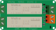

# Weiba_2Way_Relay-fritzing-part

## 喜歡請給個星星吧Orz

This is Weiba 2Way Relay fritzing part  
  
你可以自由使用這個fritzing part  
You are free to use this fritzing part(by giving me a star XD)  
  

Power Supply Voltage: 5 V  
Dimension: 72*39* 25mm (LxWxH)  
Life Time:10000000 times  
Max Frequency: =<5KHz  
weight:53.2g  
Quiescent Current:0mA  
Trigger Mode:LOW level  
Load Voltage:5-220VDC  
Load Current:5A  

請注意本圖示pcb部分僅供參考，本人不負責任和pcb生產時產生誤差的損失  
The pcb part of this picture is for reference only, and I am not responsible for the loss caused by errors in the production of pcb  
pcb部分建議使用正規電路設計軟體設計  
It is recommended to use circuit design software to design the pcb part  

## MIT License

Copyright (c) 2022 HuangYuTse

Permission is hereby granted, free of charge, to any person obtaining a copy
of this software and associated documentation files (the "Software"), to deal
in the Software without restriction, including without limitation the rights
to use, copy, modify, merge, publish, distribute, sublicense, and/or sell
copies of the Software, and to permit persons to whom the Software is
furnished to do so, subject to the following conditions:

The above copyright notice and this permission notice shall be included in all
copies or substantial portions of the Software.

THE SOFTWARE IS PROVIDED "AS IS", WITHOUT WARRANTY OF ANY KIND, EXPRESS OR
IMPLIED, INCLUDING BUT NOT LIMITED TO THE WARRANTIES OF MERCHANTABILITY,
FITNESS FOR A PARTICULAR PURPOSE AND NONINFRINGEMENT. IN NO EVENT SHALL THE
AUTHORS OR COPYRIGHT HOLDERS BE LIABLE FOR ANY CLAIM, DAMAGES OR OTHER
LIABILITY, WHETHER IN AN ACTION OF CONTRACT, TORT OR OTHERWISE, ARISING FROM,
OUT OF OR IN CONNECTION WITH THE SOFTWARE OR THE USE OR OTHER DEALINGS IN THE
SOFTWARE.
